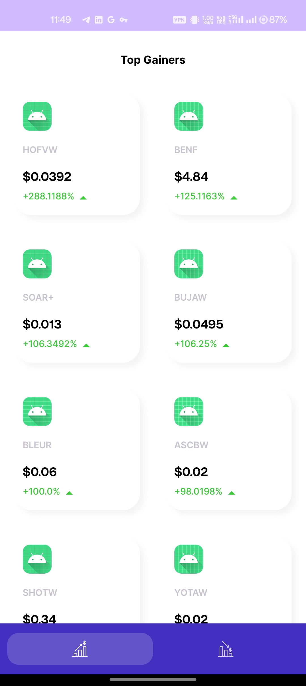
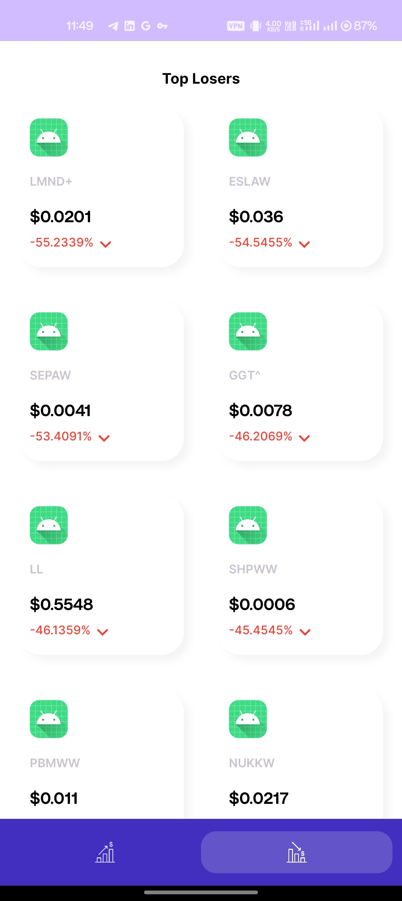
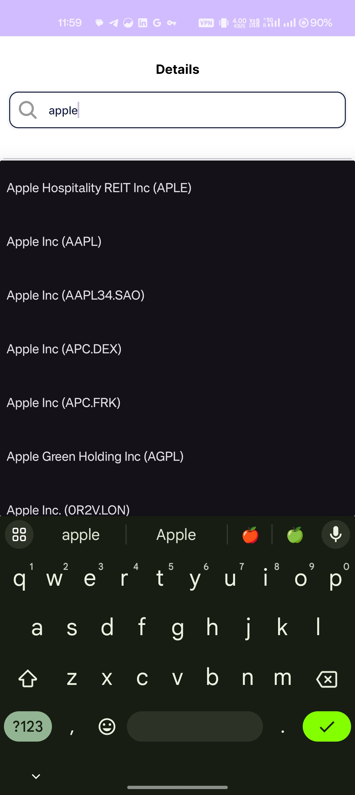
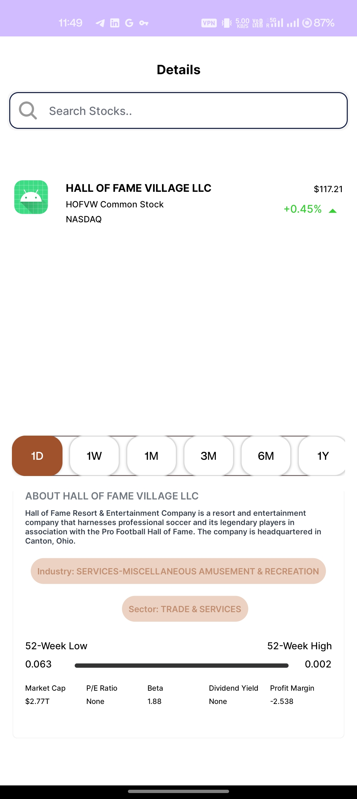

# Stocks App 

## Overview
The Stocks App is a mobile application built following the MVVM (Model-View-ViewModel) architecture. It allows users to view stock information, search for tickers, and retrieve data from an API using Retrofit. LiveData ensures real-time data observation, and caching is implemented to optimize data loading.

## Architecture
The app follows the MVVM architecture pattern:
- **Model:** Represents the data and business logic (e.g., data repository, network calls).
- **View:** Represents the UI components (e.g., activities, fragments).
- **ViewModel:** Acts as a bridge between the View and Model, managing UI-related data.

## Components Used
- **Retrofit:** Used for making API calls to retrieve stock data.
- **ViewModel:** Manages UI-related data in a lifecycle-conscious way, separating business logic from UI components.
- **LiveData:** Provides observable data that is lifecycle-aware, ensuring UI updates only when the app is in the active state.
- **Caching:** Implemented to store retrieved data locally, reducing network calls and improving app performance.

## Features
- **Stock Data Display:** Displays stock information retrieved from an external API.
- **Search Functionality:** Allows users to search for stocks by ticker symbol with autocomplete dropdown suggestions.
- **Caching:** Stores fetched data locally to minimize API calls and provide faster data retrieval.
- **Real-time Updates:** Uses LiveData to update UI components automatically when data changes.

## Implementation Details
- **API Integration:** Utilizes Retrofit library to fetch stock data from an external API (e.g., Alpha Vantage).
- **LiveData Observers:** Views observe LiveData objects in ViewModel to automatically update UI components.
- **Local Caching:** Implements caching mechanism (e.g., Room Database) to store and retrieve data locally.
- **Search with Dropdown:** Implements a search feature with autocomplete dropdown using RecyclerView and LiveData.

## Screenshots 

  
  
Top Gainers

  
  
Top Losers

  
  
Dropdown Ticker

  
  
Details Screen

## Screen Recording
https://github.com/ayushkarnn/Stocks-App/assets/41507904/94d7962d-7c04-4c1a-89b4-6f95e163f53c

## APK Download
[Install APK](https://drive.google.com/file/d/1nao7nHUZUm8RvubeNoJQtABapQsbHXPp/view?usp=sharing)
